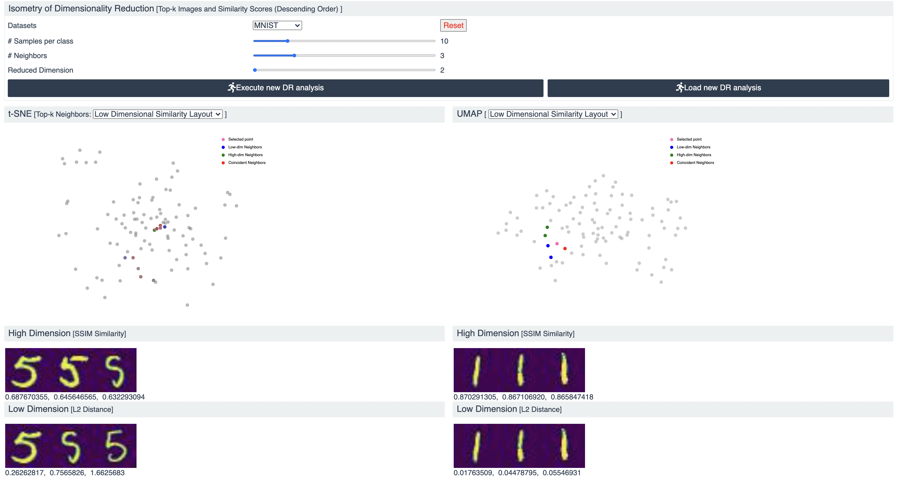

# Interactive, Interpretable and User-Friendly Dimensionality Reduction Visualization
Go to this [website for mnist](https://pages.cs.wisc.edu/~mucai/cs765/cs765_project/DR_vis) 
and [website for cifar](https://pages.cs.wisc.edu/~mucai/cs765/cs765_project/DR_vis_cifar)
 to see our visualization

## Backend Part
You may install the following libraries using `pip` or `conda`. 
### Environment and dependencies
- python 3.8
- sklearn
- skimage
- numpy
- pandas
- csv
- matplotlib  

If you decide to use LPIPS, then you also need to install:
- pytorch 1.10
- lpips

You may also try to directly build the environment using the provided `backend/packages.txt` using conda. 

### Run Backend
Go to the backend directory `cd backend`, then simply run command `python backend.py`. You can get the 
results under the default setting, which is equivalent to 
`python -W ignore backend.py --low_score TSNE --dataset mnist --sample_per_class 10`.
Alternatively, you can specify the parameters to get the results you want.

Besides, you can use `bash run.sh` to get the results under all kinds of possible 
parameter combinations for this project. 

## Frontend Part
### Environment and dependencies
You can directly download our frontend part, and see the frontend layout of our visualization. 
To be specific, our `frontend` folder already contains the data that is needed to run the data, where `mnist` and `cifar` denotes the 
frontend files for each dataset.
 Therefore, if you only would like to run the front end part,  you don't need to execute the backend part.
There are several ways to show the actual front end content.
1. Place the frontend code under the `html` folder in the server.
For example, in UW Madison CS servers, move/copy the `frontend` folder into your `~/public/html-s/cs765_project`.
Then you can access the frontend of `mnist` dataset through  `https://pages.cs.wisc.edu/~cs_user_name/cs765_project/frontend/mnist`, and
the frontend of `cifar` dataset through  `https://pages.cs.wisc.edu/~cs_user_name/cs765_project/frontend/cifar`,
where `cs_user_name` is your CS username in UW Madison CS department.
2. If you would like to run the frontend locally, you can also tools like [`VS Code Live Server Extension`](https://marketplace.visualstudio.com/items?itemName=ritwickdey.LiveServer) or `python3 -m http.server`
